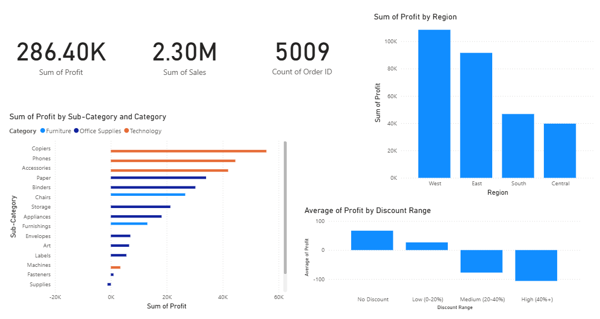

# Sales Profit Analysis

## Overview
An end-to-end analysis of retail sales data to identify which product categories, regions, and pricing strategies drive (or hurt) profitability — using SQL, Python, and Power BI.

## Business Problem
Which product categories and regions generate the most profit, so leadership can decide where to focus next quarter's sales push?

## Dataset
Kaggle "Sample Superstore" dataset — 9,994 rows, US retail orders (2015-2018), including Sales, Profit, Discount, Region, Category/Sub-Category.

## Tech Stack
PostgreSQL (pgAdmin) | Python (Pandas, Matplotlib) | Power BI | Git/GitHub

## Workflow
1. Data quality check (no cleaning needed — verified via Excel)
2. SQL analysis in PostgreSQL — 3 core business questions
3. Python EDA in Jupyter — cross-validated SQL findings, added visuals
4. Power BI dashboard — interactive KPIs and charts
5. Business recommendations

## Key Insights
- Technology sub-categories (Copiers, Phones, Accessories) generate the most profit
- Furniture "Tables" is the single biggest loss-maker (-₹17,725), despite Chairs and Furnishings being profitable
- All regions are profitable, but West earns ~3x what Central does
- Discounts above ~20% flip average profit negative

## Dashboard

## Business Recommendations
1. Cap discounts at 20% for most categories — profit turns negative beyond this threshold.
2. Review pricing/cost structure for Tables — the single biggest loss-maker in the dataset.
3. Investigate Central region's underperformance — under half of West's profit despite similar market conditions.

## Future Improvements
- Add time-series analysis (profit trends by month/year)
- Build a customer segmentation (RFM) layer
- Automate the SQL-to-Power BI refresh pipeline